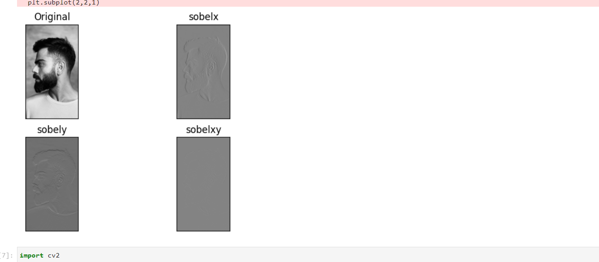
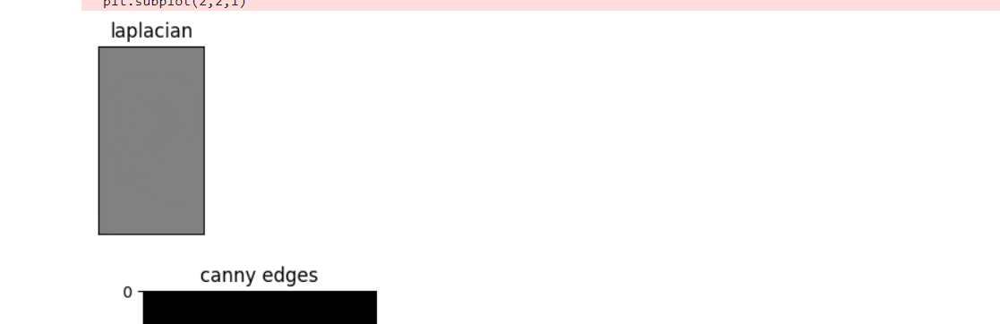
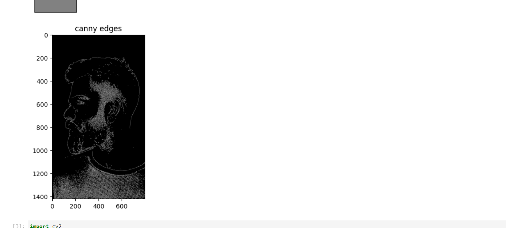

# Edge-Detection
## Aim:
To perform edge detection using Sobel, Laplacian, and Canny edge detectors.

## Software Required:
Anaconda - Python 3.7

## Algorithm:
### Step1:
Import the necessary modules.


### Step2:
For performing edge detection on a image.
-> Sobel
-> Laplacian
-> Canny

### Step3:
Display all the images with their respective edge detected images.

 
## Program:

``` Python
import cv2
import numpy as np
import matplotlib.pyplot as plt

image1=cv2.imread ('virat1.jpg') 
gray_image = cv2.cvtColor(image1,cv2.COLOR_BGR2GRAY)

plt.imshow(gray_image,cmap = 'gray')

img = cv2.GaussianBlur(gray_image,(3,3),0)
sobelx = cv2.Sobel(gray_image,cv2.CV_64F,1,0,ksize=5)
sobely = cv2.Sobel(gray_image,cv2.CV_64F,0,1,ksize=5)
sobelxy =cv2.Sobel(gray_image,cv2.CV_64F,1,1,ksize=5)
plt.figure(1)
plt.subplot(2,2,1)
plt.imshow(gray_image,cmap = 'gray')
plt.title('Original'), plt.xticks([]), plt.yticks([])

plt.subplot(2,2,2)
plt.imshow(sobelx,cmap='gray')
plt.title('sobelx')
plt.xticks([]), plt.yticks([])

plt.subplot(2,2,3)
plt.imshow(sobely,cmap='gray')
plt.title('sobely')
plt.xticks([]), plt.yticks([])

plt.subplot(2,2,4)
plt.imshow(sobelxy,cmap='gray')
plt.title('sobelxy')
plt.xticks([]), plt.yticks([])
plt.show()

## laplacian

laplacian = cv2.Laplacian(gray_image,cv2.CV_64F)
plt.imshow(laplacian,cmap='gray')
plt.title('laplacian')
plt.show()

## canny edges

canny_edges = cv2.Canny(gray_image, 120, 150)
plt.imshow(canny_edges,cmap='gray')
plt.title('canny edges')
plt.show()
```
## Output:
### SOBEL EDGE DETECTOR


### LAPLACIAN EDGE DETECTOR



### CANNY EDGE DETECTOR


## Result:
Thus the edges are detected using Sobel, Laplacian, and Canny edge detectors.
